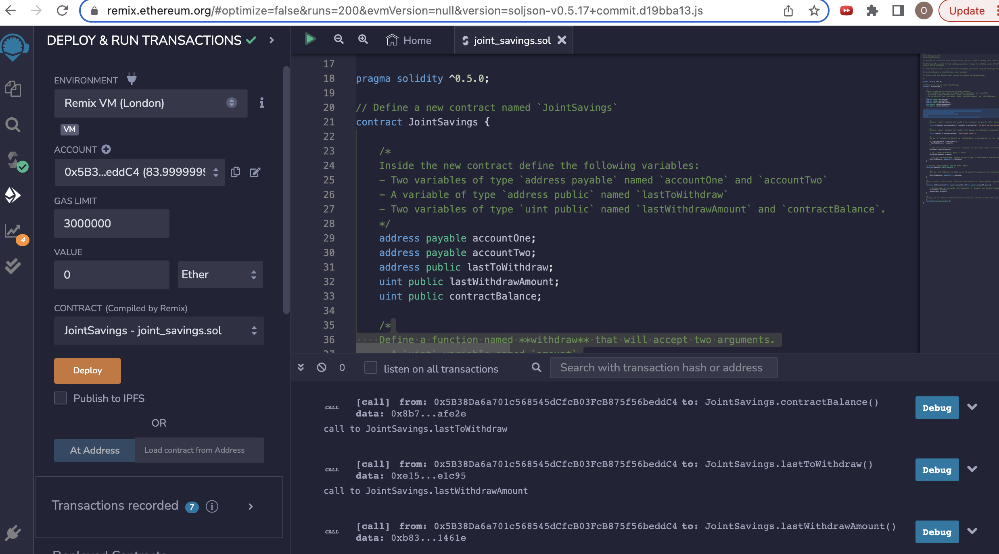
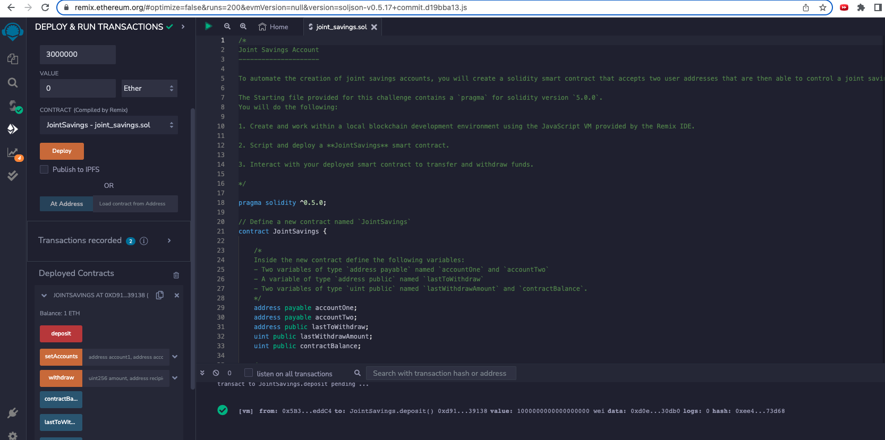
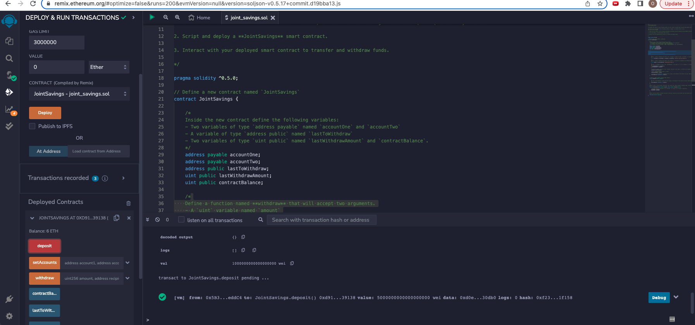
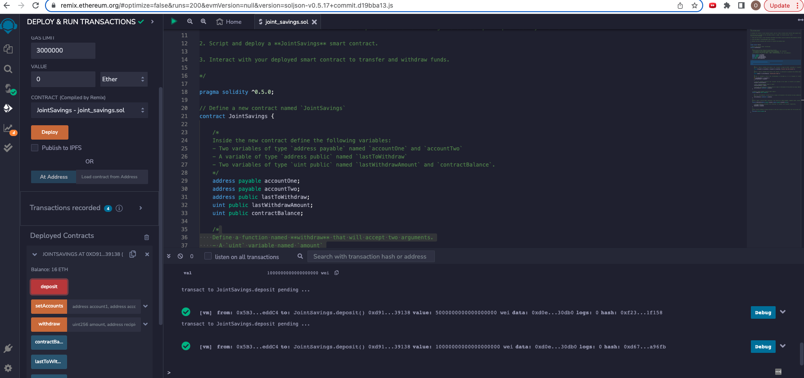
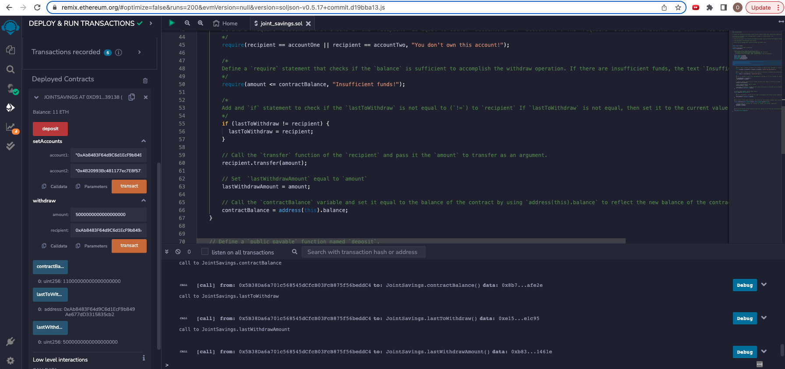
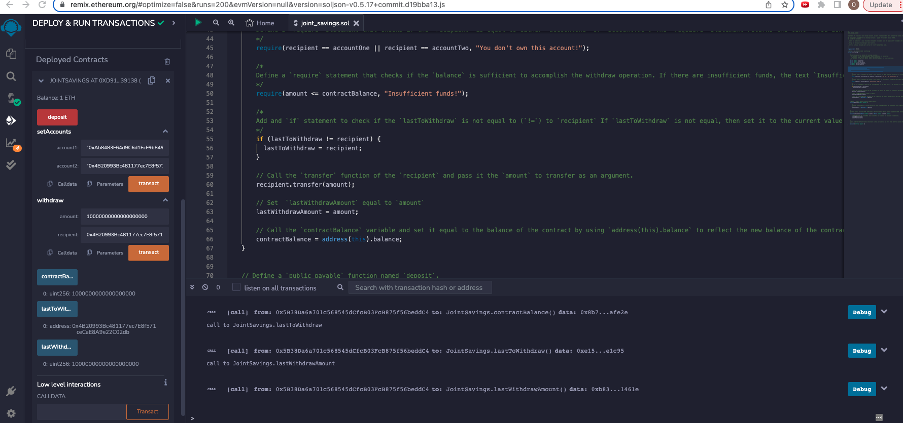
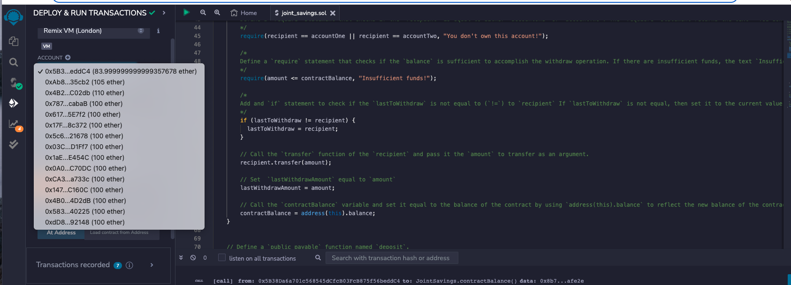

# "Joint Savings Account"

### Smart Contract 

To automate the creation of joint savings accounts, you’ll create a Solidity smart contract that accepts two user addresses. These addresses will be able to control a joint savings account. Your smart contract will use ether management functions to implement a financial institution’s requirements for providing the features of the joint savings account. These features will consist of the ability to deposit and withdraw funds from the account.

### Instructions

The steps for this homework are divided into the following sections:

1. Create a Joint Savings Account Contract in Solidity

2. Compile and Deploy Your Contract in the JavaScript VM

3. Interact with Your Deployed Smart Contract

- using setAccounts we would define ethereum address which will be able to withdraw funds from the initial contract

- Deposited 1 Ethereum

- Deposited 5 Ethereum

- Deposited 10 Ethereum

3. Once you’ve successfully deposited funds into your contract, test the contract’s withdrawal functionality by withdrawing 5 ether into `accountOne` and 10 ether into `accountTwo`. After each transaction, use the `contractBalance` function to verify that the funds were withdrawn from your contract. Also, use the `lastToWithdraw` and `lastWithdrawAmount` functions to verify that the address and amount were correct.

 - Withdrawing into AccountOne 5 Ethereum 

 - Withdrawing into AccountTwo 10 Ethereum 

- Showing changes (Increase) in AccountOne and AccountTwo 